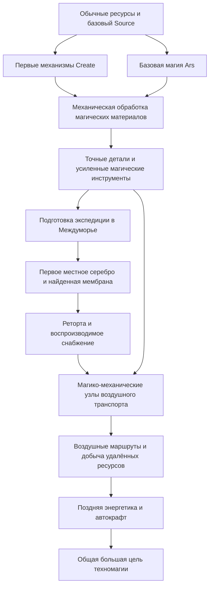

# EREZCRAFT — связанный техномагический модпак

Решение владельца от09.10.2026: EREZCRAFT — полноценный авторский модпак
в направлении ATM10, с **Create и Aeronautics**, обязательным DH и
**тесной прогрессией: техника и магия нужны друг другу**. Interstice —
авторское ядро мира, экспедиций и местной экономики внутри этой сборки.

Minecraft1.21.1, NeoForge21.1.252, Java21 сохраняются. Принятая поверхность
V6 и пользовательские сохранения не заменяются. Предыдущая сборка
Interstice0.7.0-preview.2+DH остаётся проверенным отдельным checkpoint.

## Первый технический каркас

По официальной Modrinth API и **metadata фактических JAR**, включая
вложенные Simulated/Aeronautics/Offroad, закреплены:

| Компонент | Версия | Роль |
|---|---|---|
| Interstice |0.7.0-preview.2| Междуморье, приливы, ресурсы, экспедиции |
| Create |6.0.10| Кинетическая промышленность и механическая обработка |
| Aeronautics bundled |1.3.2| Воздушные/наземные машины, Simulated и Offroad |
| Sable |2.0.6| Физика подвижных конструкций |
| Flywheel |1.0.6, внутри Create| Рендер механизмов |
| Distant Horizons |3.3.3| Дальний рендер |

[Lock-файл](../distribution/techmagic-spine.lock.json) содержит точные
version IDs, URL, SHA-512/SHA-256 и границы утверждений. Aeronautics1.3.2
требует Create≥6.0.10, Sable2.x, NeoForge≥21.1.228 и Flywheel≥1.0.6.
Устаревшая рекомендация Create6.0.9 относится к прежним Aeronautics и здесь
не используется. Наш NeoForge21.1.252 удовлетворяет указанному минимуму.

Реальная сборка движущегося корабля, прилив на борту и cold-сохранение
физики проверяются отдельно от совпадения версий и загрузки клиента.
Первый native startup **прошёл**: клиент с указанными версиями, Simulated,
Offroad и DH достиг главного меню, штатно завершился и не создавал мир.
Протокол: `.verification/20261009T153314.836889Z-techmagic-spine-first-client`.
Подготовлен импортируемый `erezcraft-techmagic-0.1.0-alpha.1-spine.mrpack`:
Interstice включён, остальные четыре исходных JAR загружаются по
зафиксированным URL/хешам. Это отдельный первый каркас, ещё без магии и
общих рецептов; он не заменяет проверенный checkpoint0.7.0-preview.2.
Официально у Aeronautics отмечены визуальные проблемы с Iris; шейдерный
стек не включается автоматически до проверки основной связки с DH.

## Состав следующих модулей

Проверены опубликованные релизы для MC1.21.1/NeoForge; это **кандидаты**,
их транзитивные зависимости и работа вместе ещё требуют проверки.

| Модуль | Кандидат | Назначение |
|---|---|---|
| Основная магия |Ars Nouveau5.13.3| Source, заклинания, ритуалы и магическая автоматизация |
| Поздняя техника |Mekanism10.7.19.85| Химическая переработка и энергетика |
| Поздняя логистика |AE2 19.2.18| Сети хранения и автокрафт |
| Дополнительная ритуальная ветвь |Occultism1.224.4| Духи и специализированные поздние операции |
| Интеграция рецептов |KubeJS2101.7.2-build.377| Собственные пересечения модов и ограничения обходов |
| Обучение |FTB Quests| Связная книга заданий; официальный CurseForge/FTB Maven |
| Интерфейс |JEI19.51.0.418, Jade15.10.6| Рецепты, назначения машин и подсказки |

Не добавлять второй обязательный рюкзак вместо уже принятого авторского.
Дополнительные магические/декоративные моды выбираются по конкретной роли,
а не количеству. Поздние цели должны потреблять результаты обеих ветвей.

## Общая прогрессия

Это проект интеграции, **новые рецепты ещё не активированы**.

На старте обе ветви используют обычные материалы. Первый источник Source
не должен требовать Create, если первый сплав Create требует Source.
Ключевые, а не все бытовые рецепты связываются через механическую обработку,
магический катализ и местные материалы. Точные ID и стоимости фиксируются
после извлечения реальных рецептов выбранных модов.

Возможные пересечения для первой реализации:

1. Первые кинетические детали требуют доступного базового магического сырья.
2. Следующий магический инструмент требует точно обработанных деталей Create.
3. Узлы продвинутого воздушного транспорта используют обработанное
   серебро/материалы реторты Междуморья и магическую обработку.
4. Высокие уровни Mekanism/AE2 получают компоненты из построенной общей цепочки.
5. Поздняя общая цель потребляет промышленность, магию, транспорт и исследование.

Сохраняется доступный первый вход: существующий нестабильный инициатор
состоит из amethyst/gold/redstone/glass обычного мира. Он не требует
мембраны/серебра Междуморья. Постоянный портал по-прежнему требует местных
материалов. Первую мембрану находят; её воспроизводство через реторту
сохраняет существующий входной узел, а не выдаёт первую мембрану из воздуха.
Обсерватория и большой эндгейм являются будущими целями, не готовыми объектами.

## Обязательные взаимодействия

- Настоящая крыша **движущегося/повёрнутого** корабля и ShelterDetector.
- Прилив для пассажира и Sable-корпуса; не использовать независимые
  несовместимые системы движения для одного тела.
- Токсичные моря, реальная геометрия волн и контакт корпуса/пассажира.
- Устойчивость перемещения между измерениями и сохранённых портальных связей.
- Контейнеры, владелец, груз, выгрузка чанка и отдельный cold-процесс.
- Другие полёты/телепорты/автоматическая добыча: они должны открывать
  осмысленное развитие и не обесценивать всю экспедицию на первом этапе.
- Рецепты с локальными рудами, обработка в Create/Mekanism/реторте и
  отсутствие циклов, бесконечной генерации или обходов одной дешёвой операцией.
- Производительность с машинами, кораблём и DH; разные системы хранения
  проверяются на сохранность, а не только наличие меню.

Новый каркас не установлен в профиль владельца. Работа ведётся в отдельном
профиле. Загрузка клиента — первый gate; она не означает готовый модпак,
работающие самолёты, настроенную магию или законченный баланс.

## Источники

- [Aeronautics и зависимости](https://modrinth.com/mod/create-aeronautics)
- [Create](https://modrinth.com/mod/create)
- [Sable](https://modrinth.com/mod/sable)
- [Ars Nouveau](https://modrinth.com/mod/ars-nouveau)
- [Mekanism](https://modrinth.com/mod/mekanism)
- [AE2](https://modrinth.com/mod/ae2)
- [FTB Quests](https://github.com/FTBTeam/FTB-Quests)
- [Официальный репозиторий ATM10](https://github.com/AllTheMods/ATM-10)
