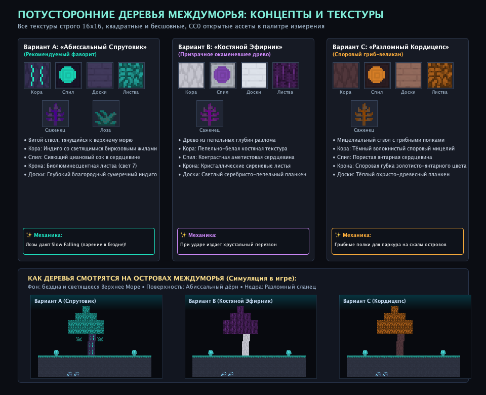

# 🌲 Потусторонние деревья Междуморья: Концепты и Текстуры

Реализован сумракрон — тёмное ветвящееся дерево с пепельно-бордовой кроной и редкими бирюзовыми акцентами. Актуальные ресурсы, поведение и проверка описаны в [ABYSSAL_VEGETATION.md](ABYSSAL_VEGETATION.md). Ниже сохранены первоначальные варианты эскизов.

Для растительного мира островов Междуморья разработаны три концепта деревьев, созданных на базе открытых **CC0 пиксель-арт ассетов (строго 16×16, квадратные и бесшовные)** с адаптацией под цветовую палитру и гравитацию измерения.

---

## 🎨 Сравнительный обзор концептов

### 1. Вариант А (Фаворит): «Абиссальный Спрутовик» (*Abyssal Tendril*)
> **Идеально гармонирует с уже внедренным Абиссальным дёрном и светящимся Верхним морем.**

* **Силуэт и рост**: Витой ствол, тянущийся вверх к перевёрнутому морю под действием приливной гравитации.
* **Кора ствола (`abyssal_log`)**: Глубокий чернильно-индиговый оттенок с пульсирующими бирюзовыми прожилками светящейся смолы.
* **Спил (`abyssal_log_top`)**: Тёмное кольцо коры с сияющей неоново-циановой сердцевиной.
* **Доски (`abyssal_planks`)**: Сумеречно-лиловый благородный планкен — уникальный цвет для строительства, отлично контрастирует с дёрном и сланцем.
* **Крона (`abyssal_leaves`)**: Полупрозрачная биолюминесцентная листва (испускает мягкий свет 7), напоминающая светящиеся глубоководные медузы.
* **Уникальная механика**: С нижних ветвей свисают **Абиссальные нити / Лозы (`abyssal_vines`)**. При контакте с ними игрок получает эффект **Замедленного падения (Slow Falling)** на несколько секунд, что спасает от гибели в бездне при прыжках между парящими островами!

---

### 2. Вариант B: «Костяной Эфирник» (*Aetheric Ashenwood*)
> **Призрачное, окаменевшее кристаллическое дерево Пустоты.**

* **Силуэт**: Резкие угловатые ветви, напоминающие застывшие разряды молнии или глубоководный белый коралл.
* **Кора**: Матово-белая, пепельная текстура окаменевшей кости.
* **Спил**: Пепельно-белое кольцо с глубокой аметистовой сердцевиной.
* **Доски**: Серебристо-белый чистый планкен (светлый строительный материал).
* **Крона**: Кристаллические сиренево-аметистовые листья.
* **Уникальная механика**: Окаменевшая природа — при ходьбе по кроне или её разрушении издаёт хрустальный перезвон аметиста.

---

### 3. Вариант C: «Разломный Кордицепс» (*Rift Sporophyte*)
> **Симбиотическое древо-гриб с горизонтальными полками-платформами.**

* **Силуэт**: Массивный вертикальный стебель из гиф с зонтиковидной споровой вершиной.
* **Кора**: Тёмно-коричневый волокнистый споровый мицелий.
* **Спил**: Пористая золотисто-янтарная сердцевина.
* **Доски**: Тёплый охристо-грибной оттенок древесины.
* **Крона**: Пористая споровая губка золотисто-янтарного цвета, выбрасывающая частицы спор.
* **Уникальная механика**: Вдоль ствола на разной высоте генерируются горизонтальные грибные полки-платформы, по которым игрок может как по ступеням взбираться на высокие скалы.

---

## 🛠 Полный набор блоков древесины для реализации

Для выбранного дерева будет создан полный традиционный Minecraft-набор:
1. **Бревно** (`_log`) и **Обтёсанное бревно** (`stripped__log`)
2. **Древесина** (`_wood`) со всех 6 сторон в коре
3. **Доски** (`_planks`)
4. **Ступени, полублоки, забор, калитка** (`stairs`, `slab`, `fence`, `fence_gate`)
5. **Дверь и люк** (`door`, `trapdoor`) с уникальным окошком
6. **Кнопка и нажимная плита** (`button`, `pressure_plate`)
7. **Листва** (`_leaves`) со сбросом саженцев и палочек
8. **Саженец** (`_sapling`) с возможностью выращивания костной мукой
9. **Свисающие лозы** (`_vines`) с эффектом плавного падения

---

## 🎮 Интеграция в генерацию мира
* Деревья будут расти на поверхности островов поверх **Абиссального дёрна** (`interstice:abyssal_turf`).
* Алгоритм генератора `IslandChunkGenerator` обеспечит разнообразие высот (5–9 блоков) и органический изгиб ствола к Верхнему Морю.
